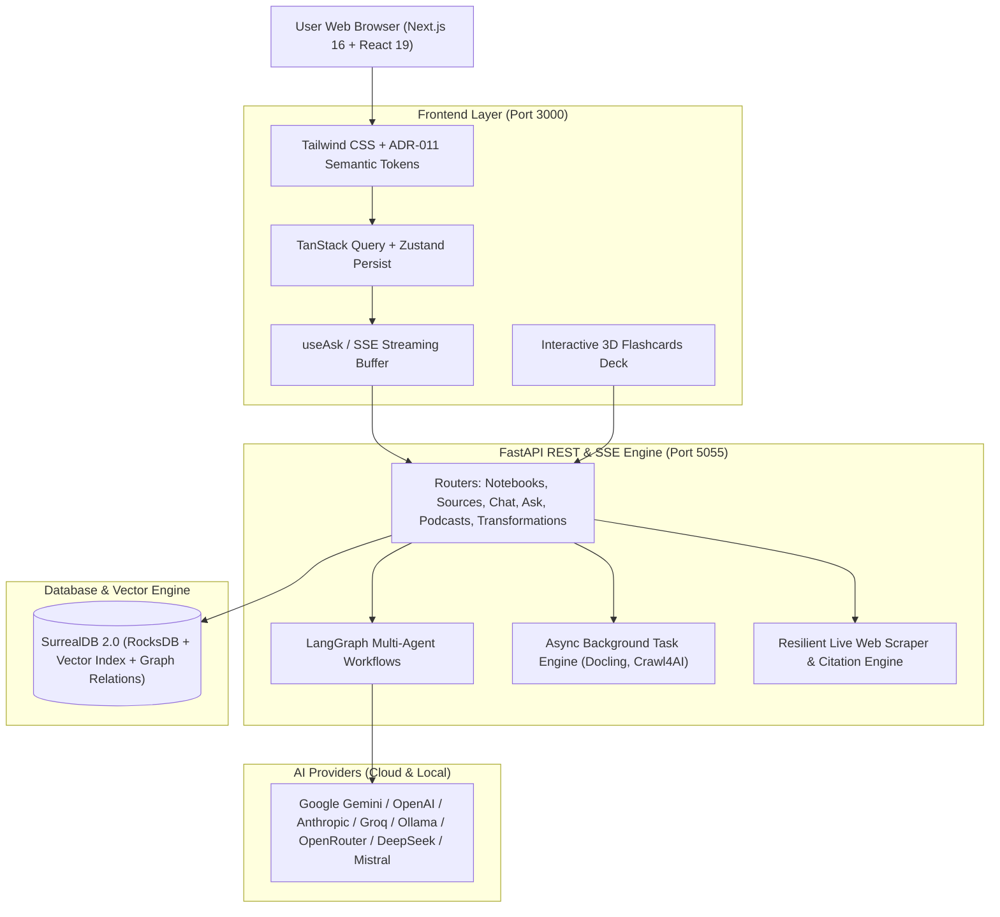

# 📚 StudyBook

> **Your Autonomous AI Research Laboratory & Cognitive Knowledge Operating System**  
> *Transform documents, multimedia, and live web intelligence into structured notebooks, interactive 3D flashcards, multi-speaker audio podcasts, and deep cited answers.*

---

## 🌟 Table of Contents
1. [Overview](#-overview)
2. [Key Architecture & Tech Stack](#-key-architecture--tech-stack)
3. [Microscopic Feature Deep Dive](#-microscopic-feature-deep-dive)
   - [1. Knowledge Base & Multi-Source Engine](#1-knowledge-base--multi-source-engine)
   - [2. Intelligent Document & URL Parsing Stack](#2-intelligent-document--url-parsing-stack)
   - [3. Notebook Workspace & Note Management](#3-notebook-workspace--note-management)
   - [4. AI Chat, Context Building & Model Control](#4-ai-chat-context-building--model-control)
   - [5. 3D Stacked Flashcards (NotebookLM-Style)](#5-3d-stacked-flashcards-notebooklm-style)
   - [6. Deep "Ask & Search" with Live Web Research](#6-deep-ask--search-with-live-web-research)
   - [7. Multi-Speaker Studio Podcasts (Audio Overviews)](#7-multi-speaker-studio-podcasts-audio-overviews)
   - [8. Structured Content Transformations](#8-structured-content-transformations)
   - [9. Models, Credentials & Multi-Provider Ecosystem](#9-models-credentials--multi-provider-ecosystem)
   - [10. Design System, Tokens, Accessibility & i18n](#10-design-system-tokens-accessibility--i18n)
4. [Getting Started & Local Development](#-getting-started--local-development)
5. [Configuration & Environment Variables](#-configuration--environment-variables)
6. [API & Architecture Walkthrough](#-api--architecture-walkthrough)

---

## 🧭 Overview

**StudyBook** is a self-hosted, privacy-first alternative to Google NotebookLM and Perplexity. It empowers students, researchers, developers, and knowledge workers to ingest diverse materials—PDFs, research papers, YouTube videos, websites, podcasts, and notes—and orchestrate them with state-of-the-art AI models.

Everything is stored locally and securely in **SurrealDB**, ensuring data sovereignty, lightning-fast vector similarity queries, and full offline persistence.

---

## 🏗️ Key Architecture & Tech Stack



- **Frontend**: Next.js 16 (App Router), React 19, TypeScript, Tailwind CSS, Radix UI primitives, Lucide Icons, KaTeX Math rendering, TanStack Query v5.
- **Backend**: FastAPI, Python 3.12, Uvicorn, LangGraph (orchestrated agent graphs), LangChain Core, Pydantic v2.
- **Database**: SurrealDB v2 (Graph database with native vector similarity, record links, and embedded JSON fields).
- **Processing Runtimes**: IBM Docling (deep OCR, tables & formulas), Crawl4AI / Firecrawl / Jina (headless URL scraping), PyTubeFix / YouTube Transcript API (audio/captions extraction).
- **Package Managers**: Strictly `pnpm` (frontend) and `pip` / `uv` (backend).

---

## 🔬 Microscopic Feature Deep Dive

### 1. Knowledge Base & Multi-Source Engine
- **Multi-Format Ingestion**:
  - **Documents**: PDF, DOCX, PPTX, XLSX, TXT, EPUB, Markdown.
  - **URLs & Articles**: Full recursive web scraping with reader clean-up.
  - **YouTube**: Automatic audio extraction, caption harvesting, and metadata analysis.
  - **Audio/Podcasts**: Direct audio transcription with speaker diarization.
- **Source Insights**:
  - Automatically extracts topics, executive summaries, key takeaways, and question-answer pairs per document.
- **Source Links & Reusability**:
  - Sources can be associated with single or multiple notebooks without duplicate storage or re-embedding.
  - Single-click source deletion preview reporting exclusive vs. shared assets.

### 2. Intelligent Document & URL Parsing Stack
- **Configurable Processing Engines**:
  - **Docling (IBM Research)**: High-fidelity layout detection, table extraction, mathematical formula preservation (`docling_formulas`), and full visual OCR (`docling_ocr`, `docling_vision`).
  - **Simple Engine**: Lightweight extraction fallback for high-throughput plain text.
  - **URL Scrapers**: Dynamic switching between `Crawl4AI` (Chromium headless browser), `Firecrawl`, `Jina Reader`, or native HTTP scrapers.
- **Auto-Deletion of Uploaded Artifacts**:
  - Configurable toggle (`auto_delete_files: 'yes' | 'no'`) to wipe raw binary uploads post-vectorization to save disk space.

### 3. Notebook Workspace & Note Management
- **Tri-Column Workspace Layout**:
  - **Left**: Sources list, upload drawer, source details dialog, and notebook metadata.
  - **Center**: Real-time collaborative Markdown notes with syntax highlighting, display math (`$$...$$`), and inline math (`$...$`).
  - **Right**: Notebook AI Chat panel with conversational history and model picker.
- **Maximize & Focus Mode**:
  - Mainstream focus mode for expanding the chat interface to maximum view without screen overflow.
- **Cascade Previews**:
  - Deleting a notebook safely warns which notes and exclusive sources will be destroyed while preserving shared assets.

### 4. AI Chat, Context Building & Model Control
- **Custom Context Builder**:
  - Dynamically builds token-calculated context packs (`chatApi.buildContext`) selecting `full` or `insights` mode per source.
- **Multi-Session Management**:
  - Create, rename, switch, and delete isolated chat sessions per notebook.
- **Reference Citations**:
  - Interactive badges formatted as `[source:id]`, `[note:id]`, or `[insight:id]`. Clicking any reference opens a preview modal directly to the referenced section.

### 5. 3D Stacked Flashcards (NotebookLM-Style)
- **Automatic 25+ Card Deck Generation**:
  - Synthesizes a minimum of 25 comprehensive questions and answers covering definitions, core concepts, formulas, and edge cases.
- **Visual 3D Stack Experience**:
  - Dynamic visual stack showing cards layered with tilt and depth perspective.
  - **Left / Wrong**: Increments wrong count and animates card away.
  - **Right / Correct**: Increments correct count and advances card.
  - **Flip**: Click card or press `Space`/`Enter`/`↑`/`↓` to flip between question and answer.
- **Permanent SurrealDB Persistence**:
  - Saves the deck array, `correct_count`, `wrong_count`, and `last_card_index` to the `flashcard_deck` table.
  - Restores the exact score and deck status when reloading or returning to the site.

### 6. Deep "Ask & Search" with Live Web Research
- **Two Distinct Modes**:
  - **Keyword & Vector Search**: Text search (titles + content) or semantic vector similarity search with score thresholds.
  - **Ask Mode**: Multi-step agent graph formulation:
    1. **Strategy Stage**: Generates search sub-queries and analytical reasoning.
    2. **Retrieval Stage**: Fanned out across knowledge base vector embeddings.
    3. **Live Web Research (Perplexity / ChatGPT-style)**:
       - Uses resilient open-source web retrieval (`backend/utils/web_search.py`).
       - Crawls top web results, strips tracking parameters, and cleans snippets.
       - Synthesizes web facts with standard markdown citations (`[Source Title](URL)`).
    4. **Final Synthesis**: Produces a unified answer with verified citations, footnotes, and math notation.

### 7. Multi-Speaker Studio Podcasts (Audio Overviews)
- **Deep Dive Audio Generation**:
  - Converts notes and sources into full multi-speaker podcast conversations (Host & Co-host format).
- **Episode & Speaker Customization**:
  - **Episode Profiles**: Adjust conversation tone (casual, technical, humorous, debate, lecture) and target duration.
  - **Speaker Profiles**: Configure voice personalities, speed, and TTS engine assignments (ElevenLabs, OpenAI TTS, Google TTS, Deepgram).
  - Built-in audio player with waveform tracking, speed control, and script transcription view.

### 8. Structured Content Transformations
- **Automated Synthesis Tools**:
  - Study Guides, FAQ Sheets, Briefing Documents, Timelines, Executive Summaries, and Custom Prompts.
  - One-click transformation of notebook content into new persistent Markdown notes.

### 9. Models, Credentials & Multi-Provider Ecosystem
- **Supported Providers**:
  - Google Gemini, OpenAI, Anthropic, Groq, Mistral, DeepSeek, xAI, OpenRouter, Cohere, Voyage, ElevenLabs, Deepgram, Ollama, Azure OpenAI, Google Cloud Vertex AI, and custom OpenAI-compatible endpoints.
- **Provider Credentials Manager**:
  - AES-256 encrypted database key storage (`backend_ENCRYPTION_KEY`).
  - Automatic connection testing before saving credentials.
  - Environment variable fallback and one-click database migration.
- **Model Role Matrix**:
  - Granular selection of distinct models for Chat, Query Strategy, Search Answers, Final Synthesis, Transformation, Large Context, TTS, and STT.

### 10. Design System, Tokens, Accessibility & i18n
- **Design Token System (ADR-011)**:
  - Custom token palette: `teal` for AI accents, `fern` for active user actions, `warn` clay accents, and reading surfaces free of color bleeding.
  - First-class Dark Mode supported without raw Tailwind utility colors.
- **Internationalization (i18n)**:
  - Strict key-parity architecture under `frontend/src/lib/locales/` ensuring missing strings fall back gracefully.
- **Keyboard Shortcuts**:
  - Global Command Palette (`Cmd/Ctrl + K`).
  - Flashcards keyboard navigation (`←`, `→`, `Space`, `Enter`, `Escape`).

---

## 🚀 Getting Started & Local Development

### Prerequisites
- Docker & Docker Compose
- Node.js 20+ & `pnpm`
- Python 3.12+

### 1. Quick Launch (Automated)
```bash
# Clone the repository
git clone https://github.com/lfnovo/StudyBook.git
cd study-book

# Launch full development environment (SurrealDB + FastAPI + Worker + Next.js)
chmod +x start-dev.sh
./start-dev.sh
```

### 2. Manual Step-by-Step Launch
```bash
# 1. Start SurrealDB
docker compose up -d surrealdb

# 2. Run backend API
python -m venv .venv
source .venv/bin/activate
pip install -e .
python run_api.py

# 3. Run frontend development server
cd frontend
pnpm install
pnpm run dev
```

Visit **http://localhost:3000** to access StudyBook.

---

## ⚙️ Configuration & Environment Variables

Copy `.env.example` to `.env` in the project root:

```env
# Application Security
backend_ENCRYPTION_KEY=generate-a-secure-random-32-byte-string

# Database (SurrealDB)
SURREAL_URL=ws://127.0.0.1:8000/rpc
SURREAL_USER=root
SURREAL_PASSWORD=root
SURREAL_NAMESPACE=backend
SURREAL_DATABASE=backend

# API Server
API_HOST=127.0.0.1
API_PORT=5055
API_RELOAD=true

# AI Provider Keys (Optional: Can also be set directly in the UI)
GEMINI_API_KEY=
OPENAI_API_KEY=
ANTHROPIC_API_KEY=
GROQ_API_KEY=
OPENROUTER_API_KEY=
OLLAMA_API_BASE=http://localhost:11434

# Feature Flags & Extraction Runtimes
backend_ENABLE_DOCLING=true
backend_ENABLE_CRAWL4AI=false
```

---

## 📡 API & Architecture Walkthrough

| Method | Endpoint | Description |
|---|---|---|
| `GET` | `/api/notebooks` | List all notebooks with note and source counters |
| `POST` | `/api/notebooks` | Create a new study notebook |
| `GET` | `/api/notebooks/{id}/flashcards` | Fetch saved 3D flashcards and study scores from SurrealDB |
| `PUT` | `/api/notebooks/{id}/flashcards` | Save cards, correct/wrong counts, and index in SurrealDB |
| `POST` | `/api/search/ask` | SSE streaming multi-stage research with live web citation |
| `POST` | `/api/search` | Fast vector / keyword search across documents |
| `POST` | `/api/podcasts/generate` | Synthesize multi-speaker studio podcast audio and transcript |
| `POST` | `/api/sources/process` | Asynchronously extract text, OCR, and embeddings |

---

## 📜 License & Acknowledgments

StudyBook is distributed under the MIT License. Built with passion for open knowledge, privacy, and continuous learning.
